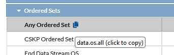
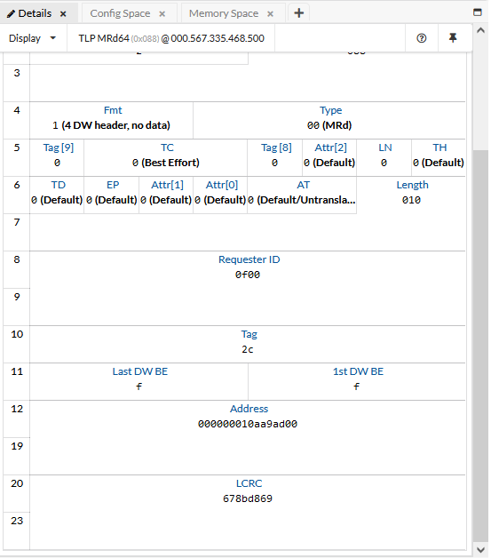
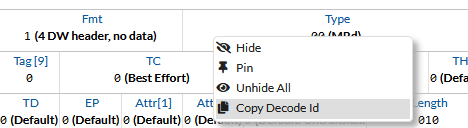

.. _ht_lib_trace_events:

Access Trace Events with the Library
====================================

Create a cursor
----------------

Trace events are accessed using a :py:class:`~serialtek.cursor.Cursor`. You can
open a cursor using :py:meth:`.Trace.open_cursor`, and iterate over events with
:py:meth:`.CursorBase.get`:

.. literalinclude:: test_traces-and-events.py
    :language: python
    :start-after: # create-a-cursor
    :end-before: ##
    :dedent:

outputs:

.. literalinclude:: test_traces-and-events.py
    :start-after: "output-1",
    :end-before: """)
    :dedent:

The events returned by :py:meth:`.CursorBase.get` will all be
:py:class:`~serialtek.event_types.trace_event.CursorEvent` objects. Here we're
printing two properties of each event:

    * ``timestamp``: The timestamp at which the event occurred.
    * ``type``: The kind of event, e.g. ``"eds"``, ``"os"``, or ``"dllp"``.

These properties are present on any
:py:class:`~serialtek.event_types.trace_event.CursorEvent`, regardless of type.
The remaining fields present on an event vary depending on its ``type``.

``event`` still holds the last event we saw above (the DLLP at
``000.000.007.430.750``), so let's take a closer look at it.

.. literalinclude:: test_traces-and-events.py
    :language: python
    :start-after: # dllp-repr
    :end-before: ##
    :dedent:

outputs:

.. literalinclude:: test_traces-and-events.py
    :start-after: "dllp-repr"
    :end-before: """)
    :dedent:

This shows all of the fields that are present on this DLLP, including its
``subtype`` (144, corresponding to ``UpdateFC_NP0``).

.. _apply_filter:

Apply a filter to a cursor
---------------------------

Imagine that we are writing a script to analyze all of the TLPs in a trace. The
events we got from the cursor above are mostly CSKP ordered sets and EDS events,
and if we were to continue going through the trace we'd see a lot more before
getting to any TLPs. We can skip over those events by assigning a
:py:class:`~serialtek.filter.Filter` to the cursor:

.. literalinclude:: test_traces-and-events.py
    :language: python
    :start-after: # filter-in
    :end-before: ##
    :dedent:

.. literalinclude:: test_traces-and-events.py
    :start-after: "filter-in"
    :end-before: """)
    :dedent:

The filter terms used (eg ``data.os.all``) correspond to the filter terms
available in the web UI's basic filter selection. Hovering over the terms in the
list will allow you to see or copy the relevant id.

For documentation on how to apply different filters to different channels or how
to exclude listed filter terms instead of only showing those terms, see the
documentation for :py:class:`~serialtek.filter.Filter`.

.. warning::

    Most traces have a very large number of events. Attempting to iterate over
    all the events in a trace without any filtering may take an unreasonably
    long time. See :ref:`guide_lib_iterating_events` for additional ways to
    mitigate this.

Decode fields on events
------------------------

The ``fields`` field on an event is a :py:class:`~serialtek.decodes.DecodedFields`
object that can be used to get the value of any field on an event. You can see
the available decodes for an event in the "details" widget of the web UI. Here
are some of the decodes for a TLP memory read:

In order to get these values from a :py:class:`~serialtek.cursor.Cursor`, you
need to request them before retrieving events. Decodes are requested by id: You
can get the Id for a particular decode by right-clicking on the field in the web
UI:

This will copy ``{"events":{"tlp":[2717525879]}}``, which is the id for Type.
You can also just use the decode's name: ``{"events":{"tlp":["Type"]}}`` is
equivalent.

.. literalinclude:: test_traces-and-events.py
    :language: python
    :start-after: # decodes
    :end-before: ##
    :dedent:

And you'll get:

.. literalinclude:: test_traces-and-events.py
    :start-after: "decodes"
    :end-before: """)
    :dedent:

:py:meth:`~serialtek.decodes.DecodedFields.get` returns a
:py:class:`~serialtek.decodes.DecodedField`. Note that it's possible to have multiple
decodes on an event with the same id, see
:py:class:`~serialtek.decodes.DecodedFields` for more information.

Iterate over transactions with a transaction builder
-----------------------------------------------------

Events provide a low-level view into what is happening on a link. Transaction
builders take these events and group them into logical transactions. A
transaction builder has the same interface as a cursor, but returns
:py:class:`~serialtek.event_types.trace_transaction.AnyTransaction` objects.

Use :py:meth:`~.Trace.open_pcie_builder` to iterate over PCIe transactions:

.. literalinclude:: test_traces-and-events.py
    :language: python
    :start-after: # pcie-builder
    :end-before: ##
    :dedent:

.. literalinclude:: test_traces-and-events.py
    :start-after: "pcie"
    :end-before: """)
    :dedent:

Each PCIe transaction includes a ``pcie_type`` field describing the kind of
transaction (eg ``"posted"`` or ``"non-posted"``).

Or use :py:meth:`~.Trace.open_nvme_builder` to iterate over NVMe transactions:

.. literalinclude:: test_traces-and-events.py
    :language: python
    :start-after: # nvme-builder
    :end-before: ##
    :dedent:

.. literalinclude:: test_traces-and-events.py
    :start-after: "nvme"
    :end-before: """)
    :dedent:

NVMe transactions include an ``nvme_type`` field with a human-readable name
(eg ``"NVMe Submission Doorbell"``). Some transactions returned by the NVMe
builder (like the PCIe posted write shown above) aren't recognized as part of
an NVMe transaction and are returned as-is, without an ``nvme_type`` field.

Examples
--------

.. dropdown:: :icon:`file code` Example: Export TLPs as HTML

    :download:`export-table.py <../../examples/export-table.py>`

    .. literalinclude:: ../../examples/export-table.py
        :language: python
